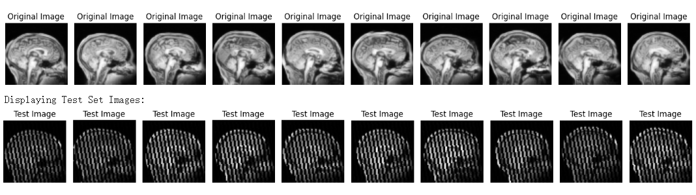
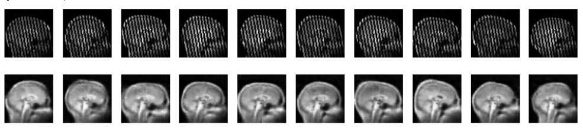

# 🧠 MRI Brain Image Line Reconstruction using Deep Neural Networks

Reconstructing missing line artefacts in corrupted 64×64 brain MRI images using fully trained-from-scratch neural architectures.

---

## 🚀 Project Motivation

Medical imaging pipelines are often affected by structured artefacts such as missing scan lines or acquisition corruption.  
This project explores how generative modelling and supervised reconstruction architectures can be combined to recover structured missing information in MRI brain scans.

The challenge:
- Test images contain structured diagonal stripe corruption.
- No clean ground-truth labels are provided for the test set.
- Reconstruction networks must be trained **from scratch** (no pre-trained models allowed).

---

## 🏗 Pipeline Overview

The project follows a three-stage pipeline:

### 1️⃣ Synthetic Data Generation

To train a reconstruction model, I first generated a large dataset of synthetic brain images using a diffusion-based generative model (`InverseLDM`).

Generation parameters explored:
- 100 → 6400 samples
- 10–30 inference steps
- DDIM vs DDPM schedulers
- Temperature: 0.6–0.9

Final dataset size: **3200 synthetic brain images**

These images were saved and reused to avoid expensive re-sampling.

---

### 2️⃣ Supervised Training Dataset Construction

Since no clean labels exist for the test set, I constructed a supervised dataset by:

- Applying a custom stripe-mask corruption process to synthetic images.
- Pairing each corrupted image with its clean counterpart.

Each training sample consists of:

Input: Corrupted image (with structured line gaps)
Target: Original clean image

A custom PyTorch `Dataset` class was implemented to:
- Dynamically apply structured corruption masks
- Maintain consistent image size (64×64)
- Provide batched training via `DataLoader`

---

## 🧠 Model Architectures Explored

### 🔹 Variational Autoencoder (VAE)

- Fully-connected encoder-decoder
- Latent space dimension: 10
- Loss: MSE + KL divergence

Result:
- Stable training
- However, reconstructions were overly smooth
- Evidence of posterior collapse
- Poor structural recovery

Conclusion: Not suitable for structured artefact reconstruction.

---

### 🔹 Convolutional U-Net (Final Model)

I implemented a convolutional encoder-decoder architecture inspired by U-Net principles.

#### Encoder:
- Conv2D + BatchNorm + ReLU
- Progressive spatial downsampling
- Channel depth: 16 → 32 → 64 → 128 → 256

#### Decoder:
- ConvTranspose2D upsampling
- Spatial resolution restoration
- Final Sigmoid activation

Training details:
- Loss: Mean Squared Error (MSE)
- Optimizer: Adam
- Learning rate: 0.002
- Epochs: 10
- Batch size: 10

Why U-Net?
- Preserves spatial structure
- Better suited for image-to-image tasks
- Stronger inductive bias for structured artefacts

---

## 📈 Results

The U-Net architecture significantly outperformed the VAE:

- Sharper structural reconstruction
- Better recovery of missing diagonal lines
- Improved spatial coherence

After training:
- The model was applied to the corrupted test set.
- Missing lines were reconstructed.
- Results saved as:

test_set_nogaps.npy

Requirements satisfied:
- Correct image size (64×64)
- Same order as original `test_set.npy`
- All test images included

---

## 🧪 Technologies Used

- PyTorch
- NumPy
- Matplotlib
- Diffusion-based generative modelling (InverseLDM)
- Google Colab GPU

---

## 🧠 Key Takeaways

- Structured corruption benefits from convolutional architectures over fully-connected latent models.
- Posterior collapse can limit VAE reconstruction capability in deterministic tasks.
- Proper synthetic data generation is critical when real labels are unavailable.
- Architectural inductive bias matters significantly in spatial reconstruction problems.

---

## 📌 Future Improvements

- Add skip connections to strengthen spatial recovery.
- Experiment with perceptual or SSIM loss.
- Use masked loss to focus learning on corrupted regions.
- Explore hybrid diffusion-based reconstruction.

---

## 🔎 Reconstruction Results

### Original Image

### Predicted Image

